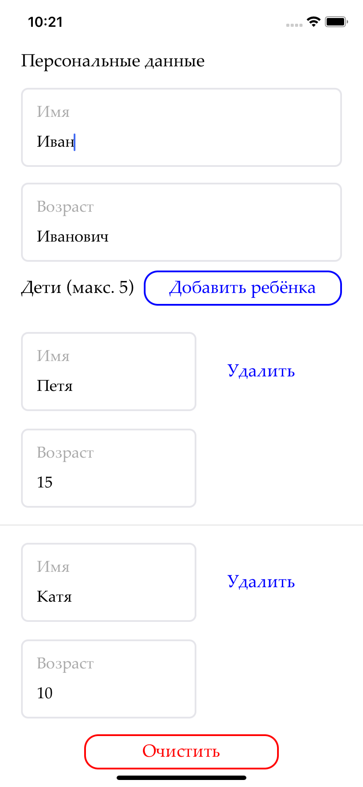
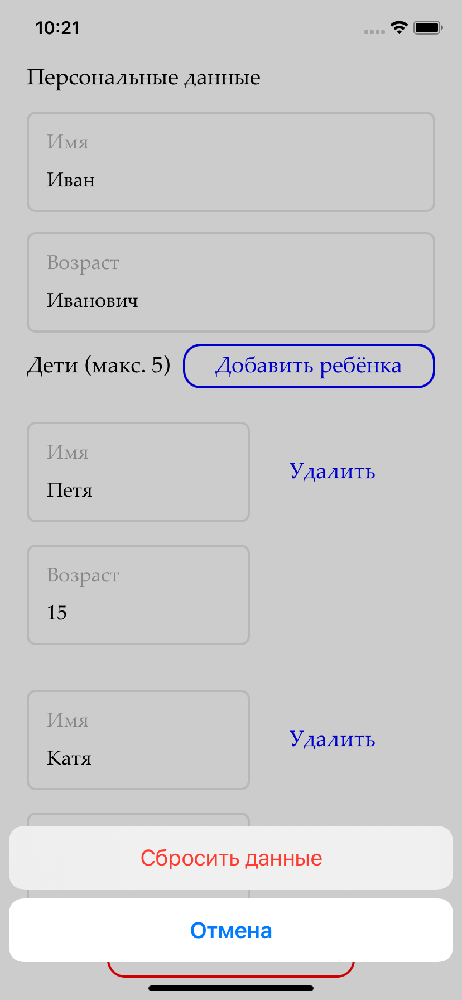

Решение тестового задания для собеседования.

## Описание приложения

Приложение с экраном, где человек может заполнить информацию о себе и своих детях.

Кнопкой "добавить ребёнка" можно добавить в таблицу ещё одного ребёнка.

Максимум можно добавить 5 детей, после этого пнока "добавить ребёнка" исчезает.

При нажатии на кнопку "очистить" появляется ActionSheet с двумя кнопками:

- сбросить данные
- отмена

 
